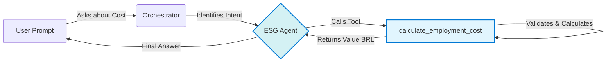

# 🤖 ESG Agent: Green Employment Cost Calculator

This project is a functional AI Copilot built as part of the **Azure Frontier Girls Challenge** by Microsoft & WoMakersCode. It serves as a practical demonstration of building an "AI Agent" with custom tools, leveraging Azure OpenAI services.

---

## 1. Project Objective & Problem

### The Problem
Public policy managers and ESG (Environmental, Social, Governance) analysts often need to make quick, data-driven decisions to fund sustainability and social inclusion programs. However, rapidly estimating the cost of initiatives, such as green employment programs, is a complex task that often relies on manual calculations.

### The Agent's Objective (The Product)
This project is an **AI Agent (Copilot)** that acts as an "ESG Public Policy Assistant."

Its goal is to provide a simple, conversational interface for a manager to estimate the cost of a green employment program. The agent uses a custom-built "Tool" to perform the business logic (the calculation), demonstrating an architecture where the AI (the "brain") uses specialized tools (the "muscles") to solve a problem.

## 2. Architecture & Execution Flow

This agent uses an orchestrator model provided by the Microsoft Agent Framework. The framework analyzes the user's intent and routes the task to the correct tool.

## 3. Demonstration (The "Functional Action")

The "Functional Action" for this challenge is a **calculation**. The agent identifies the user's intent to calculate a cost, extracts the parameters (`number_of_people`, `contract_months`, `minimum_wage`), and calls the custom Python tool to get the result.

## 4. Linked Resources

* **Azure Frontier Girls:** The Microsoft program this challenge is part of.

* **Data Analysis (MBA Thesis):** This agent's business logic is based on the cost models developed in my MBA Data Science & Analytics Thesis (USP). The full data analysis repository can be found here: https://github.com/a-learte/ndvi-empregabilidade-verde

## 5. Author

* **Amanda Morais** - [LinkedIn](https://www.linkedin.com/in/amandalearte)